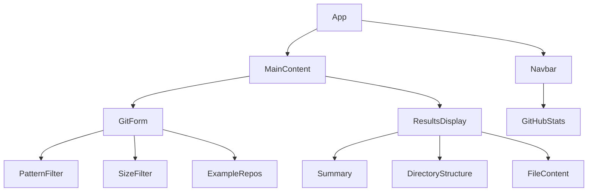

# Gitingest React Refactoring Plan

This document outlines the comprehensive plan for refactoring Gitingest's frontend from Jinja templates to a modern React implementation. It is structured to be token-aware, context-aware, and optimized for LLM consumption.

## Table of Contents
- [Current Architecture Overview](#current-architecture-overview)
- [Target Architecture](#target-architecture)
- [Component Structure](#component-structure)
- [Migration Strategy](#migration-strategy)
- [Testing Strategy](#testing-strategy)
- [Security & Analytics](#security--analytics)
- [Deployment Strategy](#deployment-strategy)
- [Rollback Plan](#rollback-plan)
- [Success Metrics](#success-metrics)

## Current Architecture Overview

The current implementation uses:
- FastAPI backend with Jinja2 templating
- Server-side rendered pages
- TailwindCSS for styling
- Vanilla JavaScript for interactivity

Core components:
- Navbar (GitHub stars, navigation)
- Git Form (repository input, pattern filtering)
- Results Display (summary, directory structure, file content)

## Target Architecture

The new architecture will maintain the FastAPI backend while modernizing the frontend:

### Frontend Stack
- React 18 with functional components
- Vite for build tooling (lightweight, fast)
- React Query for API state management
- TailwindCSS (retained)
- TypeScript for type safety

### Key Benefits
- Improved component reusability
- Better state management
- Enhanced type safety
- Improved development experience
- Better performance through client-side rendering

## Component Structure



## Migration Strategy

### Phase 1: Project Setup

1. Initialize new Vite project with React + TypeScript
   ```bash
   mkdir frontend
   cd frontend
   npm create vite@latest . --template react-ts
   ```

2. Install Required Dependencies
   ```bash
   # Core dependencies
   npm install react-router-dom @tanstack/react-query

   # TypeScript types
   npm install --save-dev @types/node @types/react-router-dom

   # TailwindCSS and plugins
   npm install --save-dev tailwindcss postcss autoprefixer @tailwindcss/forms @tailwindcss/typography
   ```

3. Configure TailwindCSS
   ```bash
   # Initialize Tailwind and PostCSS configs
   npx tailwindcss init -p
   ```

   Update tailwind.config.js:
   ```typescript
   /** @type {import('tailwindcss').Config} */
   export default {
     content: [
       "./index.html",
       "./src/**/*.{js,ts,jsx,tsx}",
     ],
     theme: {
       extend: {},
     },
     plugins: [
       require('@tailwindcss/forms'),
       require('@tailwindcss/typography'),
     ],
   }
   ```

   Update src/index.css with Tailwind directives:
   ```css
   @tailwind base;
   @tailwind components;
   @tailwind utilities;

   @layer base {
     html {
       @apply antialiased;
     }
     body {
       @apply bg-white text-gray-900 min-h-screen;
     }
   }
   ```

4. Configure Vite
   ```typescript
   // vite.config.ts
   import { defineConfig } from 'vite'
   import react from '@vitejs/plugin-react'

   export default defineConfig({
     plugins: [react()],
     server: {
       port: 3000,
       proxy: {
         '/api': {
           target: 'http://localhost:8000',
           changeOrigin: true,
         },
       },
     },
     build: {
       target: 'esnext',
       minify: 'esbuild',
       rollupOptions: {
         output: {
           manualChunks: {
             'react-vendor': ['react', 'react-dom'],
           },
         },
       },
     },
   })
   ```

5. Set up Project Structure
   ```
   src/
   ├── components/
   │   └── ErrorBoundary.tsx
   ├── providers/
   │   └── AppProviders.tsx
   ├── hooks/
   ├── types/
   ├── utils/
   └── api/
   ```

6. Implement Core Provider Setup
   ```typescript
   // src/providers/AppProviders.tsx
   import { ReactNode } from 'react'
   import { BrowserRouter as Router } from 'react-router-dom'
   import { QueryClient, QueryClientProvider } from '@tanstack/react-query'

   interface AppProvidersProps {
     children: ReactNode
     queryClient: QueryClient
   }

   export function AppProviders({ children, queryClient }: AppProvidersProps) {
     return (
       <QueryClientProvider client={queryClient}>
         <Router>{children}</Router>
       </QueryClientProvider>
     )
   }
   ```

7. Configure Error Boundaries
   ```typescript
   // src/components/ErrorBoundary.tsx
   import { Component, ErrorInfo, ReactNode } from 'react'

   interface Props {
     children: ReactNode
     fallback: ReactNode
   }

   interface State {
     hasError: boolean
     error: Error | null
   }

   class ErrorBoundary extends Component<Props, State> {
     public state: State = {
       hasError: false,
       error: null,
     }

     public static getDerivedStateFromError(error: Error): State {
       return {
         hasError: true,
         error,
       }
     }

     public componentDidCatch(error: Error, errorInfo: ErrorInfo) {
       console.error('Uncaught error:', error, errorInfo)
     }

     public render() {
       if (this.state.hasError) {
         return this.props.fallback
       }

       return this.props.children
     }
   }

   export default ErrorBoundary
   ```

8. Set up React Query Client
   ```typescript
   // src/main.tsx
   import { QueryClient } from '@tanstack/react-query'
   import React from 'react'
   import ReactDOM from 'react-dom/client'
   import App from './App'
   import './index.css'
   import { AppProviders } from './providers/AppProviders'

   const queryClient = new QueryClient({
     defaultOptions: {
       queries: {
         staleTime: 5 * 60 * 1000, // 5 minutes
         gcTime: 30 * 60 * 1000, // 30 minutes
         retry: (failureCount: number, error: unknown) => {
           if (error instanceof Error && error.name === 'RateLimitError') {
             return false
           }
           return failureCount < 3
         },
       },
     },
   })

   ReactDOM.createRoot(document.getElementById('root')!).render(
     <React.StrictMode>
       <AppProviders queryClient={queryClient}>
         <App />
       </AppProviders>
     </React.StrictMode>
   )
   ```

9. Implement Basic App Component
   ```typescript
   // src/App.tsx
   import { Route, Routes } from 'react-router-dom'
   import ErrorBoundary from './components/ErrorBoundary'
   import { usePageTracking } from './hooks/usePageTracking'

   function App() {
     usePageTracking()

     return (
       <ErrorBoundary fallback={<ErrorFallback />}>
         <Routes>
           <Route path="/" element={<MainContent />} />
         </Routes>
       </ErrorBoundary>
     )
   }

   export default App
   ```

Note: Analytics setup (PostHog) should be deferred until Phase 4 when we implement performance monitoring and tracking. This ensures we have a clear analytics strategy and proper environment variable configuration in place.

### Phase 2: Component Migration

1. **Shared Components**
   - Convert SVG assets to React components
   - Create base UI components with ARIA support:
     ```tsx
     // components/ui/Button.tsx
     interface ButtonProps {
       variant: 'primary' | 'secondary';
       children: React.ReactNode;
       onClick?: () => void;
       'aria-label'?: string;
       disabled?: boolean;
     }
     ```
   - Implement shared layouts with proper semantic HTML

2. **Navbar Component**
   - Migrate GitHub stars fetching to React Query:
     ```tsx
     const { data: stars, isError } = useQuery({
       queryKey: ['github-stars'],
       queryFn: fetchGitHubStars,
       retry: 2,
       staleTime: 5 * 60 * 1000
     });
     ```
   - Convert navigation links with proper ARIA roles
   - Implement responsive design with keyboard navigation

3. **Git Form Component**
   - Convert form to controlled components with validation:
     ```tsx
     interface GitFormState {
       input: string;
       pattern: string;
       fileSize: number;
       patternType: 'include' | 'exclude';
     }
     ```
   - Implement pattern filtering with accessibility
   - Add file size slider with ARIA labels
   - Add loading states and error handling

4. **Results Display**
   - Create Summary component with copy functionality
   - Implement Directory Structure with keyboard navigation
   - Create File Content display with syntax highlighting
   - Add download and copy features with success feedback

### Phase 3: State Management

1. **API Integration**
   - Create API client with rate limiting:
     ```typescript
     // api/client.ts
     export const processRepository = async (url: string) => {
       const controller = new AbortController();
       const timeoutId = setTimeout(() => controller.abort(), 30000);
   
       try {
         const response = await fetch('/api/process', {
           method: 'POST',
           headers: {
             'Content-Type': 'application/json',
             'X-CSRF-Token': getCsrfToken(),
           },
           body: JSON.stringify({ url }),
           signal: controller.signal
         });
   
         if (response.status === 429) {
           throw new RateLimitError('Too many requests');
         }
   
         return response.json();
       } finally {
         clearTimeout(timeoutId);
       }
     };
     ```
   - Implement React Query hooks with retry logic
   - Add loading states and error handling

2. **Form State**
   - Manage form inputs with React state
   - Implement input sanitization:
     ```typescript
     const sanitizeInput = (input: string): string => {
       return DOMPurify.sanitize(input.trim());
     };
     ```
   - Add validation and error handling

3. **URL State**
   - Sync URL parameters with form state
   - Handle direct URL access
   - Implement browser history management

### Phase 4: Performance Optimization

1. **Code Splitting**
   ```typescript
   const ResultsDisplay = lazy(() => import('./components/ResultsDisplay'));
   ```

2. **Caching Strategy**
   - Implement React Query caching:
     ```typescript
     const queryClient = new QueryClient({
       defaultOptions: {
         queries: {
           staleTime: 5 * 60 * 1000,
           cacheTime: 30 * 60 * 1000,
           retry: (failureCount, error) => {
             if (error instanceof RateLimitError) return false;
             return failureCount < 3;
           }
         }
       }
     });
     ```
   - Add service worker for offline support
   - Cache API responses

3. **Loading States**
   - Add skeleton components
   - Implement optimistic updates
   - Add progress indicators

## Testing Strategy

### Unit Tests
```typescript
// components/GitForm.test.tsx
describe('GitForm', () => {
  it('validates repository URL', () => {
    render(<GitForm />);
    const input = screen.getByRole('textbox', { name: /repository url/i });
    fireEvent.change(input, { target: { value: 'invalid-url' } });
    expect(screen.getByText('Invalid URL')).toBeInTheDocument();
  });

  it('handles rate limiting errors', async () => {
    server.use(
      rest.post('/api/process', (req, res, ctx) => {
        return res(ctx.status(429));
      })
    );
    
    render(<GitForm />);
    await userEvent.click(screen.getByRole('button', { name: /submit/i }));
    expect(screen.getByText(/too many requests/i)).toBeInTheDocument();
  });
});
```

### Integration Tests
- Test component interactions
- Test API integration
- Test form submission flow
- Test accessibility features

### E2E Tests
- Test complete user flows
- Test browser interactions
- Test responsive design
- Test keyboard navigation

## Security & Analytics

### Analytics Implementation
```typescript
// config/analytics.ts
export const initAnalytics = () => {
  if (process.env.NODE_ENV === 'production') {
    window.posthog.init(process.env.POSTHOG_KEY, {
      api_host: process.env.POSTHOG_HOST,
      capture_pageview: false, // Manual capture for SPA
      persistence: 'localStorage'
    });
  }
};

// hooks/usePageTracking.ts
export const usePageTracking = () => {
  const location = useLocation();
  
  useEffect(() => {
    window.posthog?.capture('$pageview', {
      path: location.pathname
    });
  }, [location]);
};
```

### Security Measures

1. **CSRF Protection**
   ```typescript
   // utils/csrf.ts
   export const getCsrfToken = () => {
     return document.querySelector<HTMLMetaElement>('meta[name="csrf-token"]')?.content;
   };
   ```

2. **Rate Limiting**
   - Client-side throttling
   - Exponential backoff for retries
   - User feedback for rate limits

3. **Input Validation**
   - Sanitize all user inputs
   - Validate URLs and patterns
   - Escape special characters

4. **Error Handling**
   - Custom error boundaries
   - Graceful degradation
   - User-friendly error messages

## Deployment Strategy

### Build Process
1. Configure Vite build:
   ```javascript
   // vite.config.ts
   export default defineConfig({
     build: {
       target: 'esnext',
       minify: 'esbuild',
       rollupOptions: {
         output: {
           manualChunks: {
             'react-vendor': ['react', 'react-dom'],
             'query': ['@tanstack/react-query']
           }
         }
       }
     }
   });
   ```

2. Integration with Backend
   - Configure API proxy
   - Set up CORS
   - Handle environment variables

3. Monitoring
   - Add error tracking
   - Implement analytics
   - Monitor performance metrics

## Rollback Plan

### Backup Strategy
1. Version Control
   - Maintain separate branches
   - Regular commits with clear messages
   - Tag important milestones

2. Fallback Mechanism
   - Traffic routing
   - Feature flags
   - A/B testing capability

## Success Metrics

### Performance
- Improved load times
  - Target: < 2s initial load
  - Target: < 100ms for subsequent interactions
- Reduced TTFB
- Better Core Web Vitals

### User Experience
- Smoother interactions
- Faster form submissions
- Better error handling
- Improved accessibility scores

### Development
- Improved code maintainability
- Better type safety
- Easier testing
- Reduced bug reports

## Implementation Notes

This refactoring should be implemented incrementally, with each phase thoroughly tested before moving to the next. The modular nature of React components allows us to migrate piece by piece while maintaining the existing functionality.

Key considerations:
1. Maintain feature parity throughout the migration
2. Ensure backward compatibility
3. Monitor performance metrics
4. Keep bundle size optimized
5. Maintain accessibility standards
6. Implement proper security measures
7. Set up comprehensive analytics tracking

The end result will be a modern, maintainable React application that provides a better user experience while maintaining all existing functionality.
